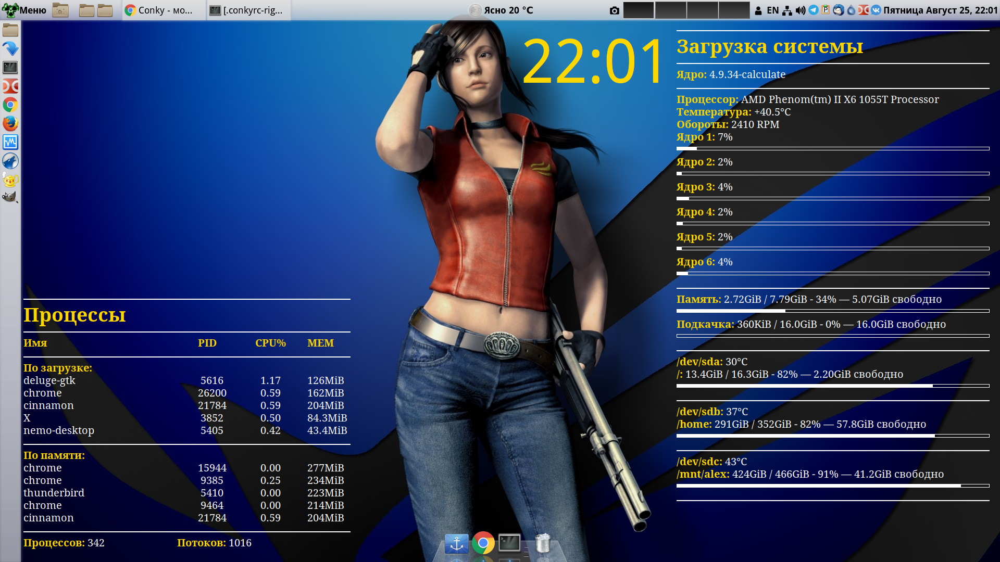

# goldfish
Конфиг для "коньков". 
## Установка
Для использования склонируйте папку goldfish в ~/.conky/
,а для запуска используйте скрипты ~/.conky/goldfish/conky-{left,right}.sh
## Требования
Требуются установленные и настроенные под ваше оборудование:

* hddtemp (запущенный демон или с доступом для обычного пользователя)
* lm_sensors (замените temp2 и fan2 на подходящие для вашего процессора значения в .conkyrc-right)

## Скриншоты

